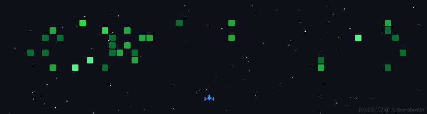

<h1>Hey, I'm Shyamalan Kannan 👋</h1>

###### 👀 Something someone used to say:

"Data! Data! Data! I can’t make bricks without clay." — The Adventures of the Copper Beeches by Arthur Conan Doyle

  

###### ⛓️ Connect with me:

###### 📊 Technical Skills:

**Languages & Tools:**

**Frameworks & Web:**

**Cloud, Databases & DevOps:**

**Engineering Practices & Security:**

**Data & Search (from projects/skills):**

###### 📜 Certifications:
- AWS Cloud Solutions Architect (Coursera/AWS, 2025)
- Google Advanced Data Analytics (Coursera/Google, 2026)
- IBM Data Science Professional (Coursera/IBM, 2026)
- IBM AI Developer (Coursera/IBM, 2026)

